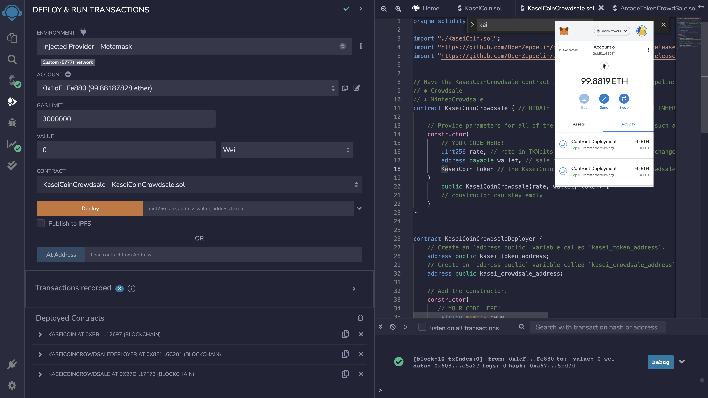

# Lesson_21
# Primary application file
Create a fungible token that is ERC-20 compliant and that will be minted by using a Crowdsale contract from the OpenZeppelin Solidity library.

The crowdsale contract that created will manage the entire crowdsale process, allowing users to send ether to the contract and in return receive KAI, or KaseiCoin tokens. Your contract will mint the tokens automatically and distribute them to buyers in one transaction.

---

## Technologies

The following Technologies were used to develop this program:

Solidity

Terminal
    Version 2.12.5 (444)

Visual Studio Code
    Version: 1.66.2 (Universal)
    Commit: dfd34e8260c270da74b5c2d86d61aee4b6d56977
    Date: 2022-04-11T07:49:20.994Z
    Electron: 17.2.0
    Chromium: 98.0.4758.109
    Node.js: 16.13.0
    V8: 9.8.177.11-electron.0
    OS: Darwin x64 21.4.0
    
---

## General information about analysis.
There are four parts to this Lesson:

### Create the KaseiCoin Token Contract:

Import the following contracts from the OpenZeppelin library into KaseiCoin contract:

ERC20

ERC20Detailed

ERC20Mintable

Define a contract for the KaseiCoin token called KaseiCoin, and have the contract inherit the three contracts that you just imported from OpenZeppelin.  Then inside of your KaseiCoin contract, add a constructor with the following parameters: name, symbol, and initial_supply.  After that, as part of your constructor definition, add a call to the ERC20Detailed contract’s constructor, passing the parameters name, symbol, and 18. Recall that 18 is the value for the decimal parameter.  Finally compile the contract using compiler version 0.5.5.

### Create the KaseiCoin Crowdsale Contract:

Ensure the crowd sale has the OpenZeppelin contracts for Crowdsale and MintedCrowdsale.  Next with the KaseiCoinCrowdsale constructor provide parameters for all of the features needed for the crowd sale, such as rate, wallet, and token and then configure these parameters for the KaseiCoin token.  Compile the contract using compilier version 0.5.5.

### Create the KaseiCoin Deployer Contract:

In this section, you will create the KaseiCoin deployer contract. Start by uncommenting the KaseiCoinCrowdsaleDeployer contract in the provided KaseiCoinCrowdsale.sol starter code.

Next, within the KaseiCoinCrowdsaleDeployer contract, add variables to store the addresses of the KaseiCoin and KaseiCoinCrowdsale contracts, which this contract will deploy. This is done by completing the following step:

Create an address public variable called kasei_token_address, which will store KaseiCoin’s address once that contract has been deployed.

Create an address public variable called kasei_crowdsale_address, which will store KaseiCoinCrowdsale's address once that contract has been deployed.

Add the following parameters to the constructor for the KaseiCoinCrowdsaleDeployer contract: name, symbol, and wallet.

Then create the KaseiCoin token by using a new instance of the KaseiCoin contract with parameters name and symbol, and by setting the initial_supply parameter to 0.

Assign the KaseiCoin token contract’s address to the kasei_token_address variable. This will allow you to easily fetch the token's address later.

Create a new instance of the KaseiCoinCrowdsale contract using the following parameters, rate, wallet (Pass wallet, and token. 

Assign the KaseiCoin crowdsale contract’s address to the kasei_crowdsale_address variable. This will allow you to easily fetch the crowdsale’s address later.

Set the KaseiCoinCrowdsale contract as a minter.

Have the KaseiCoinCrowdsaleDeployer renounce its minter role.

Compile the contract using compiler version 0.5.5.

### Deploy the Crowdsale to a Local Blockchain:

First deploy the crowdsale to a local blockchain with Remix, MetaMask, and Ganache.

Solidity and Metamask showing contracts are deployed:

Ganache for KaseiCoin file:

Ganache for KaseiCoin Crowd Sale Deployer:

Ganache for KaseiCoin Crowd Sale:

---

## Information about datasets

Contract:

KaseiCoin

KaseiCoinCrowdsale

Variables:

   address:
    
   kasei_token_address
   
   kasei_crowdsale_address
   
   wallet
   
   
   uint:
   
   rate
   
   
   string:
   
   symbol
   
   name
   

---

## Libraries used in analysis

pragma solidity ^0.5.0

pragma solidity ^0.5.5

---

## Contributors

**Chris Miskovich**

Contact Information:

Email: cmiskovich@verizon.net

[LinkedIn](https://www.linkedin.com/in/christopher-miskovich-9a61b0234/) 

---

## License

[MIT](/license.txt)
